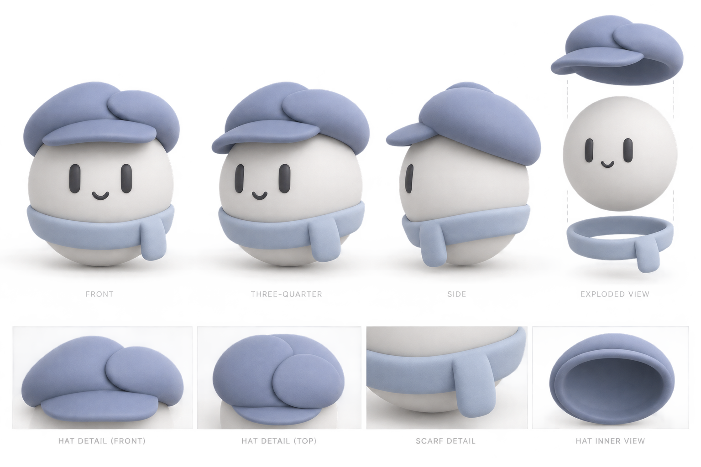

# Avatar

The runtime character uses authored native WGPU surfaces. The reference bitmap is not a runtime asset. Geometry is tessellated once into a shared mesh atlas; only transforms, materials and expression weights change during animation. The GPU uses three flat cel-shading tones, stylized cast shadows and a thin material-colored inverted-hull contour for a 3D-to-2D cartoon appearance. Facial features use solid ink without an extra contour. Derivative-filtered shade boundaries and 4× MSAA keep edges smooth during animation; there are no specular highlights or material grain.

Each avatar renders into a cached transparent texture with orthographic projection. Shrinking reuses the larger target instead of reallocating textures during animation. Composition maps the framebuffer-clipped viewport back to the original image's UV region, so crossing a window edge crops the avatar without stretching it. The caller supplies its painter and clipping region: style-card avatars sit inside the card header next to its title, while the application companion uses a separate foreground layer. Rendering alone does not intercept input; the companion has a compact interactive region covering its body and clothing.

The code lives under `rust-client/src/ui/components/avatar`:

- `geometry/`: surface tessellation, the fitted body profile and continuous facial strokes with GPU morph targets.
- `classic/`: the character's materials and assembly, with its tailored cap and scarf meshes in `clothing.rs`.
- `face.rs`, `motion.rs`, `wardrobe.rs`: independent facial objects, expressions/gaze and hat/scarf/tie attachment sockets.
- `render/`: shared WGPU resources, 3D/shadow passes and transparent 2D composition. `export.rs` is a debug-only PNG renderer using those same passes.
- `companion.rs`: the simple body variants used by style cards.
- `speech.rs`: screen-facing speech bubbles with delayed following, animated bounds and opacity, Unicode grapheme reveal, punctuation pauses and independent mouth activity.

The application companion lives in `ui/companion/`. `mod.rs` owns one persistent scene across onboarding, translation, studios, settings and plugin pages; `dialogue.rs` owns all dialogue selection, contextual replies and model/voice/resource status cues. `attention.rs` reads hovered or keyboard-focused controls from egui on the first welcome page only. `parking.rs` finds quiet space in the painted content of other pages, preferring the title's right-hand whitespace, then a smaller size or another clear position. It caches the result and checks for layout changes at a bounded interval. `placement.rs` shares silhouette bounds between pointer capture, travel and window clamping. The app shell renders the companion after page content and modal handling. Onboarding only supplies its special introductory layout and existing prerequisite result; individual pages contain no dialogue or movement logic. Translations reuse the existing five-language table.

The opening sequence peeks in facing the viewer with a roll tilt, greets, waits for reading time, turns away, takes three subtle receding steps to 58% size, then turns back. Switching pages keeps the same character and cancels obsolete speech without replaying the opening. Onboarding entry/status cues are announced once per session after a settling delay. Other pages stay quiet unless the character is clicked; their controls do not attract it. Idle has no orbit or bobbing.

Dragging takes over the choreography without snapping the grab point to the center. Its held size stays stable and gently settles to the small size after release. On the first welcome page, dragging clears the previous attention target and delays renewed attention for 1.2 seconds; a new target then satisfies the normal dwell threshold before travel resumes. The later welcome steps rest beside the header. On other application pages, a clear drop position is retained; an obstructing position is replaced with a clear parking spot after the release delay. Changing pages or layout revalidates parking. If no clear space exists, the companion waits hidden until space becomes available. Only the avatar captures clicks, so dragging over a page control cannot activate it.

The scene clock pauses during pointer presses, popups and loss of window focus. New page announcements wait while a text field is focused. Bubble following uses a separate visual delta so it continues smoothly during dragging. Modal dialogs hide the overlay. Leaving onboarding keeps the same scene; resuming focus does not fast-forward the choreography. Bubbles are painted in screen coordinates, separately from model rotation, without reserving layout space or intercepting clicks. Once settled, animation stops polling at frame rate; scheduled blinks and input wake it.

The body uses three cubic Bézier profile segments with fuller cheeks and a softened lower pole. Facial tangent frames and the scarf fit use that same profile. The eyes and mouth each have a single continuous mesh, with neutral, happy and blink/curious shapes blended on the GPU. Eyes stay vertical in the front view.

The cap has two surface patches following a curved overlap, a shared inner seam, an open cavity and rolled edges. The visor and hanging scarf tail use authored Bézier outlines with thickness and bend; the wrapping scarf has a flattened cloth cross section fitted to the body. These are dedicated meshes, not scaled spheres or toruses. `Attachment` applies each socket's local transform before the whole avatar receives its pose.

The body half-width is approximately one unit. Neutral eye centers are at x = ±0.34 and y = 0.20; eye height is 0.396 and width 0.158. The smile starts at y = −0.02 and spans 0.226. Clothing is authored against those same body coordinates, then stored in socket-local coordinates.

## Render to 2D

From the repository root, run:

```powershell
cargo run -p rust-client --offline -- --avatar-render target/avatar-review
```

This uses the real GPU renderer without opening the app or loading user configuration. It writes 1024×1024 transparent PNGs for the front, three-quarter, side, back, happy, blink, curious, exploded and underside views, plus `preview.png` with three views on a neutral background. PNG export converts the premultiplied linear target to straight sRGB alpha, preserving soft edges. Re-running replaces those named outputs. The command is excluded from release builds; this is a modeling/export tool, not another regression suite.



Generated with the built-in image generation tool. This is a modeling reference, not an exact screenshot or a packaged runtime asset.

## Generation prompt

```text
Use case: stylized-concept
Asset type: 3D character modeling reference sheet for the XRTranslate desktop app.
Primary request: Design one original adorable minimalist floating round mascot whose identity comes from its wearable 3D hat, not stickers or arbitrary ornaments. It must be straightforward to construct with smooth rounded 3D solids.
Subject: A soft matte light gray-white spherical body, no arms or legs, two dark thick round-ended vertical pill eyes, a tiny curved smile. The eyes may bend into happy arches. No realistic pupils, no painted highlights. A charming small slate-blue / muted periwinkle courier beret sits properly on the head: a compact flattened dome, a short rounded forward visor, and two softly overlapping rounded folds at the crown suggest a pair of conversational speech bubbles through their physical silhouette. Keep the hat restrained and cute, not tall or elaborate. A small matching cool pale-blue scarf wraps the lower body with one short rounded tail, no bow. The round body remains dominant.
Composition: clean white modeling sheet showing front, three-quarter and side views of exactly the same character, plus a small exploded view separating the removable hat, scarf and bare body to clarify the clothing attachment system. Consistent proportions across views.
Materials and lighting: matte clay-like smooth solids, very soft neutral studio lighting, subtle form shadows, no glossy specular highlights or glowing edges.
Constraints: no lettering, no logos, no X stickers, no badges, no ears, no antlers, no antennae, no random decorative symbols, no busy texture. The hat's sculpted silhouette is the unique identity. Clothing must have real thickness and wrap around the body in three dimensions. This is a practical reference for native GPU modeling, not a UI mockup.
```
