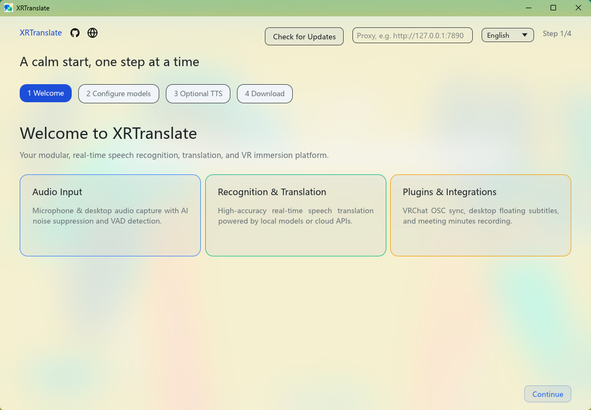
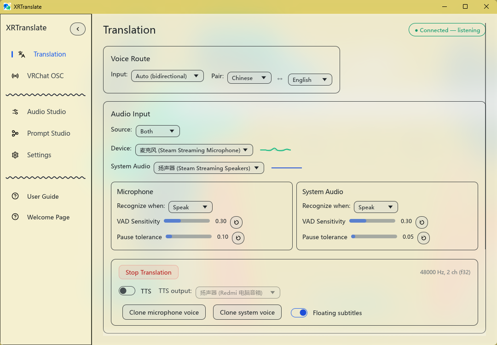
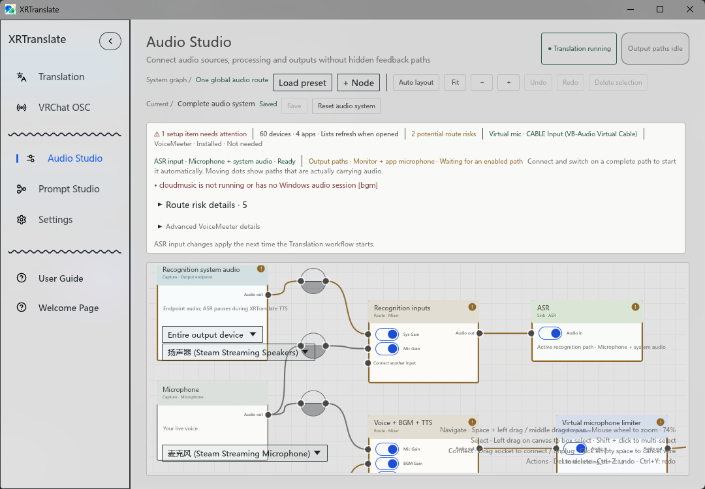

<p align="center">
  
</p>

<h1 align="center">XRTranslate</h1>

<p align="center">
  <a href="https://github.com/NowLoadY/XRTranslate/releases/latest">최신 릴리스 다운로드</a>
</p>

<p align="center">
  <strong>데스크톱, 미디어 및 VRChat을 위한 실시간 자막 및 음성 번역</strong>
</p>

<p align="center">
  <a href="../../README.md">English</a> •
  <a href="README_CN.md">简体中文</a> •
  <a href="README_JA.md">日本語</a> •
  <b>한국어</b> •
  <a href="README_DE.md">Deutsch</a> •
  <a href="README_FR.md">Français</a> •
  <a href="README_ES.md">Español</a> •
  <a href="README_RU.md">Русский</a> •
  <a href="README_SV.md">Svenska</a>
</p>

<p align="center">
  <a href="#인터페이스-미리보기">인터페이스 미리보기</a> •
  <a href="#사용-가이드">사용 가이드</a> •
  <a href="#주요-파일-및-경로">주요 파일 및 경로</a> •
  <a href="#citation">Citation</a> •
  <a href="#기여자--contributors">기여자</a> •
  <a href="#감사의-글">감사의 글</a> •
  <a href="#라이선스">라이선스</a>
</p>

<p align="center">
  언어와 마이크를 선택하고 클릭 한 번으로 실시간 번역을 시작하세요.
</p>

---

## 인터페이스 미리보기

처음 실행하면 환영 페이지에서 필수 준비 과정을 안내합니다. 이후에도 사이드바를 통해 언제든지 다시 열 수 있습니다.

<p align="center">
  
</p>

비디오 자막 생성 및 고성능 직접 재생을 지원합니다.

<p align="center">
  
</p>

<p align="center">
  
</p>

OSC 자막은 메시지를 개별적으로 표시하거나 하나로 병합하여 정렬할 수 있습니다.

<table>
  <tr>
    <td width="50%" align="center"></td>
    <td width="50%" align="center"></td>
  </tr>
  <tr>
    <td align="center"><sub>개별 표시</sub></td>
    <td align="center"><sub>병합 표시</sub></td>
  </tr>
</table>

OSC를 통한 빠른 타이핑 입력 및 실시간 번역 전송을 지원합니다.

<p align="center">
  
</p>

번역마다 나만의 스타일을 더해 보세요.

<p align="center">
  
</p>

Audio Studio에서 마이크, 시스템 오디오, 번역 경로를 한눈에 확인할 수 있습니다.

<p align="center">
  
</p>

---

## 사용 가이드

[GitHub Releases](https://github.com/NowLoadY/XRTranslate/releases)에서 최신 Windows 버전을 다운로드하고 압축을 푼 후 XRTranslate를 실행하세요. 초기 실행 마법사가 런타임 환경과 모델을 자동으로 준비합니다. 설정이 완료되면 바로 번역을 시작할 수 있습니다.

---

## 주요 파일 및 경로

| 항목 | 기본 경로 | 설명 |
| :--- | :--- | :--- |
| **모델 파일** | `models/` | 음성 인식 및 번역 모델 패키지 저장 위치 |
| **전문 용어 코퍼스** | [XR Corpus](https://github.com/NowLoadY/XR-Corpus) | 독립적으로 유지 관리되는 Markdown 용어 및 컨텍스트 서비스 |
| **실행 로그** | `runtime/logs/` | 백엔드 서비스 및 클라이언트 실행 로그 확인 |
| **로컬 설정** | `config.json` | 포트 번호, 모델 설정 및 렌더링 매개변수 구성 |

### 기본 모델 리소스 사용량

아래 수치는 기본 설정으로 두 모델을 모두 GPU에서 실행했을 때의 참고값입니다. 사용 중인 GPU, llama.cpp 버전 및 설정에 따라 약간의 차이가 있을 수 있습니다.

| 모델 | 용도 | 파일 크기 | 예상 VRAM 사용량 |
| :--- | :--- | :--- | :--- |
| **음성 인식 모델** | 음성 인식 | 약 1.8 GB | 약 2.7 GB |
| **번역 모델** | 번역 | 약 1.1 GB | 약 1.4 GB |

두 모델을 동시에 실행할 경우 약 **4.1 GB**의 VRAM을 사용합니다. 운영체제 및 기타 프로그램을 위한 공간을 확보하기 위해 8 GB 이상의 VRAM을 갖춘 그래픽 카드를 권장합니다.

---

## Citation

```bibtex
@misc{zhao2026xtranslatorrealtimemultilingualspeakeraware,
      title={X-Translator: A Real-Time Multilingual Speaker-Aware Speech-to-Speech Translation System},
      author={Yuxiang Zhao and Yichi Zhang and Yanjie An and Yanqiao Zhu and Zhanxun Liu and Yushen Chen and Qixi Zheng and Haina Zhu and Yunchong Xiao and Keqi Deng and Shuai Fan and Kai Yu and Xie Chen},
      year={2026},
      eprint={2607.17544},
      archivePrefix={arXiv},
      primaryClass={eess.AS},
      url={https://arxiv.org/abs/2607.17544},
}
```

---

## 기여자 / Contributors

XRTranslate 개발에 기여해주신 코드 기여자 및 베타 테스터 여러분께 진심으로 감사드립니다. 전체 기여자 명단, 소셜 링크 및 기여 내역은 [docs/contributors.md](../contributors.md)에서 확인하실 수 있습니다.

---

## 감사의 글

원본 [X-Translator](https://github.com/zhaoyx239/X-Translator) 프로젝트와 뛰어난 기여를 해주신 개발자 팀에 진심으로 감사드립니다.

또한 [XTalk](https://github.com/xcc-zach/xtalk), [X-ASR](https://github.com/Gilgamesh-J/X-ASR), [Paraformer](https://github.com/modelscope/FunASR), [SenseVoice](https://github.com/FunAudioLLM/SenseVoice), [NiuTrans LMT](https://github.com/NiuTrans/LMT), [Hunyuan-MT](https://github.com/Tencent-Hunyuan/Hunyuan-MT), [X-Voice](https://github.com/sunnyxrxrx/X-Voice), [IndexTTS](https://github.com/index-tts/index-tts), [OpenSTBench](https://github.com/sjtuayj/OpenSTBench)에 감사드립니다.

영감과 소중한 기여를 제공해 주신 [Yakutan](https://github.com/febilly/Yakutan)과 저자 [febilly](https://github.com/febilly) 님께 특별한 감사를 전합니다.

## 라이선스

이 저장소에는 서로 다른 오픈 소스 라이선스로 배포된 코드가 포함되어 있습니다:

- 원본 X-Translator 프로젝트에서 유래된 코드는 [MIT License](../../LICENSE-MIT)를 따릅니다.
- 네이티브 Rust 클라이언트 및 새로 추가된 코드는 [GNU Affero General Public License v3.0 (AGPL-3.0)](../../LICENSE)을 따릅니다.

자세한 라이선스 조건은 저장소 내 라이선스 파일과 해당 소스 코드를 참조하세요.
